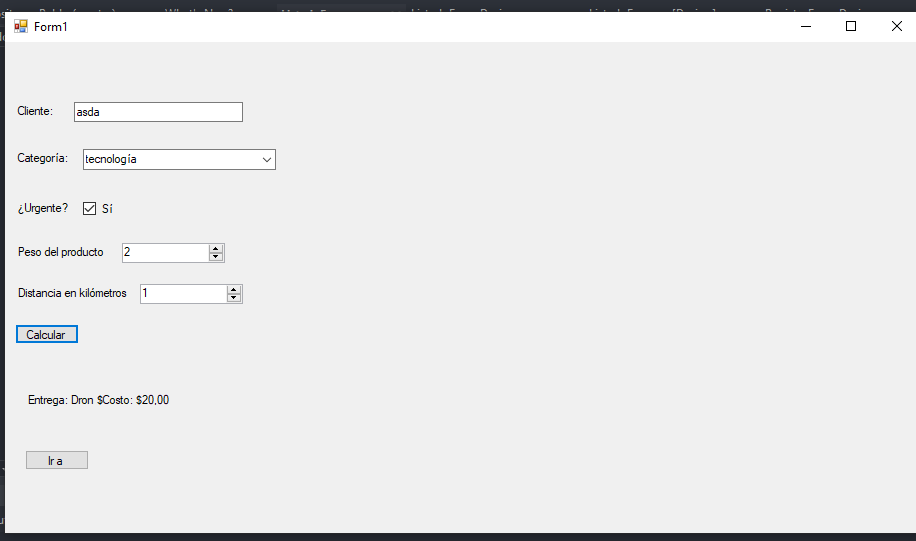
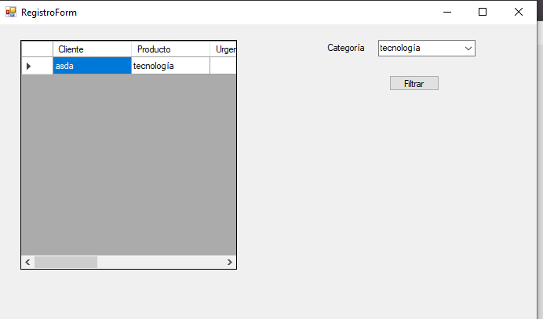

# PedidosApp

Aplicación de escritorio desarrollada en C# Windows Forms para la gestión de pedidos, como parte de la práctica evaluativa de la asignatura **Herramientas de Programación II**.

## 🧠 Propósito

El objetivo de este proyecto es demostrar buenas prácticas de programación orientada a objetos (POO) aplicadas a una aplicación escalable, utilizando patrones de diseño como **Singleton**, **Factory** y **Strategy**.

---

## 🚀 Funcionalidades

- Registrar pedidos con distintas estrategias de entrega.
- Mostrar historial de pedidos en un formulario con `DataGridView`.
- Filtrar historial por tipo de entrega mediante `ComboBox`.
- Aplicación de validaciones y manejo de excepciones.
- Uso de patrones de diseño para facilitar la escalabilidad y el mantenimiento del sistema.

---

## 🧩 Reglas de negocio implementadas

### 1. Si el producto es "tecnología" y es urgente => Dron.
### 2. Si el producto es "accesorio" => Motocicleta.
### 3. Si el producto es "componente" o si el peso supera los 10kg => Camion.
### 4. Cada transporte tiene su propia tarifa por km:
    o Dron: 20 * km
    o Motocicleta: 10 * km
    o Camion: 5 * km

###  5. Entrega ecológica en bicicleta
- Clase: `EntregaBicicleta`
- Condición: si el producto es tipo "accesorio", pesa menos de 2kg y **no** es urgente.
- Costo: `3 * km`.

###  6. Historial de pedidos
- Nuevo formulario que muestra todos los pedidos registrados en `RegistroPedidos`.

###  7. Filtrado por tipo de entrega
- `ComboBox` para seleccionar el tipo de entrega y filtrar el historial en tiempo real.

---

## 🖼️ Capturas de pantalla

### Formulario principal  


### Historial de pedidos con filtro aplicado  


---

## ⚙️ Instrucciones para ejecutar

1. Clona este repositorio:
   ```bash
   git clone https://github.com/LordCasta/PedidosApp.git
